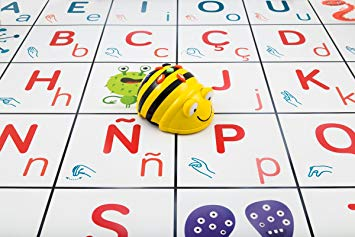
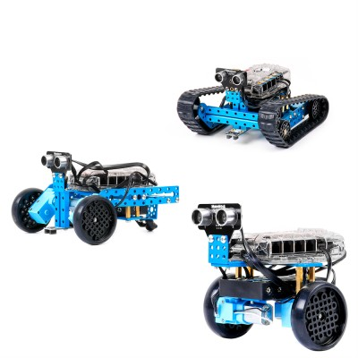
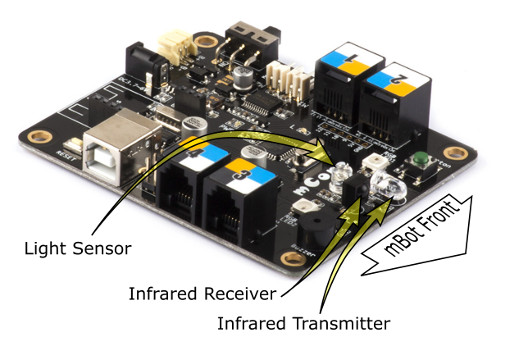

# Equipos

## [BeeBot](https://ro-botica.com/es/tienda/Bee-Bot/)

Versión barata en forma de ratón

Next 1.0 de Edelvives

Alternativa open: [Escornabot](./escornabot.md)

## [Makey-Makey](./MakeyMakey.md)

## [Meccanoid](https://www.juguetronica.com/meccanoid-g15ks)

## Lego

### Lego WeDo (150)

### Lego NXT

[Lego EV3](https://www.amazon.es/LEGO-Mindstorms-juguete-electr%C3%B3nico-31313/dp/B00BMKLVJ6/ref=sr_1_1?ie=UTF8&qid=1495724987&sr=8-1&keywords=lego+ev3) (320€)

## MakeBlock

Es un mecano con corazón de Arduino.

Programable con bloques

[Recursos](https://www.makeblock.es/soporte/robot-mbot/)

[Empezando con MakeBlock](https://programamos.es/conoce-la-interfaz-de-mblock-y-programa-los-primeros-pasos-de-tu-mbot/)

## [Raspberry](./Raspberry.md)

## [micro:bit](./Microbit.md)

# Problemas y sus soluciones

## El coste

Uno de los problemas que se plantea cuando se quiere hacer robótica en el aula es que tiene el coste y que normalmente los centros no disponen de presupuesto para ello.
En ese punto siempre aparece la disyuntiva de si usar un kit o los componentes

Por un lado un kit es sencillo de usar pero costoso

Por otro lado los componentes son baratos pero difíciles de usar

Una posible solución consiste en  involucrar a distintos niveles con distintas capacidades y dándoles tareas con distinto nivel de dificultad

Al construir el kit estamos aprendiendo electrónica, soldadura, impresión 3D, a leer esquemas,.... y estamos fabricando los componentes que pueden usar los más pequeños

## Posibilidad de personalización

## Externalizar servicios

* Alquiler de equipos
* Servicios externos de impresión
