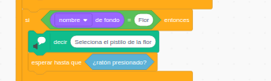

# Preguntas y respuestas

Otro gran uso muy interesante de MakeyMakey es el crear teclados específicos para nuestros programas, pueden tener forma de mapa, con distintos colores para las distintas respuestas o cualquier forma que se nos ocurra. 

Los podemos usar para seleccionar la respuesta a una pregunta.

# Pregunta con varias respuestas

Vamos a empezar haciendo ejemplos en los que tenemos una pregunta y varias respuestas posibles.

En esta caso conectaremos cada respuesta a uno de los botones MakeyMakey (el usuario tiene que tener contacto con Tierra)

Podemos tener varias preguntas sucesivas, pero necesitamos saber en cual estamos. Para ello podemos usar distintos fondos.

## Ejemplo: Mapa de Andalucía

Vamos a adaptar el programa del recorrido por Andalucía que hicimos a un formato de preguntas y respuestas.

Para ello usaremos un mapa que hemos impreso y al que hemos colocado encuadernadores donde conectamos los botones de la MakeyMakey:

El programa espera hasta que se haya pulsado una tecla y luego comprueba si es la correcta.

Utilizamos mensajes para pasar de una pregunta a otra.

Es muy sencillo añadir una nueva pregunta sin más que duplicar el bloque de una provincia, crear un nuevo mensaje y cambiar la tecla de la respuesta correcta.

[Proyecto](https://scratch.mit.edu/projects/367536515/)

[Vídeo: Pregunta con varias respuestas. Mapa de Andalucía](https://youtu.be/TAlhmtgIDn8)

## Teclados a medida

Otro gran uso muy interesante de MakeyMakey es el crear teclados específicos para nuestros programas.

En este caso vamos a usar uno primorosamente elaborado por mi hija con goma Eva, cartón y papel de aluminio.

Utiliza los colores típicos de Kahoot (de hecho, ¿podríamos hacer una versión de conocido programa con Scratch? ¿alguien se anima?) 

La idea es hacer una pregunta, y que se utilice el teclado para dar la respuesta. En nuestro programa codificaremos qué color corresponde a cada respuesta.

## Clic en una parte de la imagen

En este ejemplo, elaborado junto con una Profe de Ciencias Naturales, se trabaja las plantas. 

Para saber en qué pregunta estamos utilizamos los distintos fondos, y en función a ellos los personajes (plantas en este caso) se muestran u ocultan.

El objetivo es conseguir la atención de los alumnos, por eso en pantalla no se muestran las preguntas ni las respuestas en pantalla, sino que tienen que escucharlas aténtamente.

Hay 2 tipos de preguntas:

* Las que tienen cuatro respuestas, para las que usaremos el teclado de colores:

* Las que piden que se haga clic en una parte de la imagen

    

Los distintos objetos se muestran o no según el fondo usando los eventos de cambio de fondo:
    

Para hacer que sólo sea válido el clic en una parte de la imagen, lo que hacemos es crear un objeto que tiene como aspecto la parte de la imagen que queremos señalar y lo ponemos justo en el lugar adecuado para que encaje con el fondo (en la imagen lo he movido un poco para que se entienda el truco). 

Asociado al evento de clic sobre el objeto hacemos que se cambie el fondo, dando paso a la siguiente pregunta.

[Proyecto](https://scratch.mit.edu/projects/350351898/)

[Vídeo: Usando un teclado personalizado con Scratch y MakeyMakey](https://youtu.be/FFwtElewTnk)

## Varias preguntas y  varias respuestas. Emparejando

Vamos hacer ahora un ejemplo en el que tenemos varias preguntas y sus respuestas todas juntas. Es un juego de emparejar las preguntas y las respuestas.

## Ejemplo: Sintagmas

Lo utilizaremos para probar los conocimientos de sintagmas, usando este montaje que una Maestra elaboró para otra edición de este curso:

Tenemos que enlazar cada palabra con su categoría gramatical. 

Conectaremos cada palabra y cada categoría a una salida del MakeyMakey. No podemos usar Earth para codificar las distintas respuestas. Pensadlo o probarlo.

Un par pregunta-respuesta estará formado por 2 teclas y tenemos que codificar en nuestro programa cuáles son válidas.

Para eso usamos el operador lógico **"Y"** que solo dará como resultado verdadero si los dos datos lo son, como en este ejemplo:

Sólo será válido cuando se estén pulsando las dos teclas a la vez

Nos queda un proyecto muy sencillo.

[Proyecto](https://scratch.mit.edu/projects/401038007/)

Reutilizamos el bloque **"DecirAlto"** que guardamos en la mochila.

[Vídeo: Preguntas y respuestas con Scratch y MakeyMakey](https://youtu.be/n7vo6uhMCZk)

