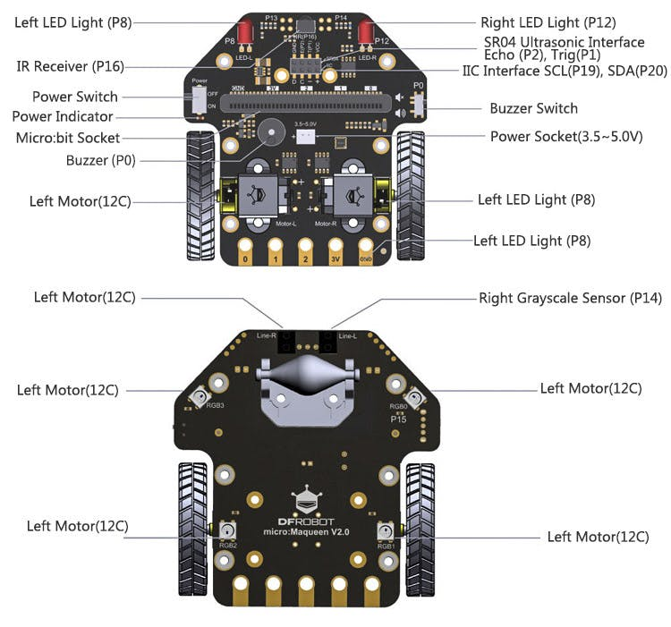
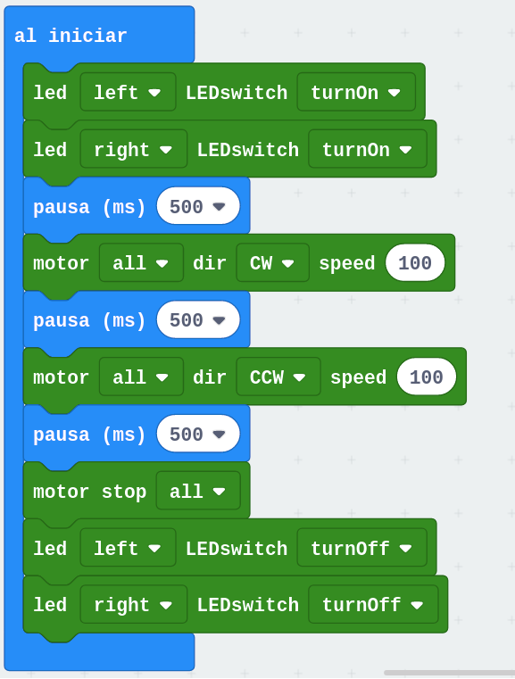
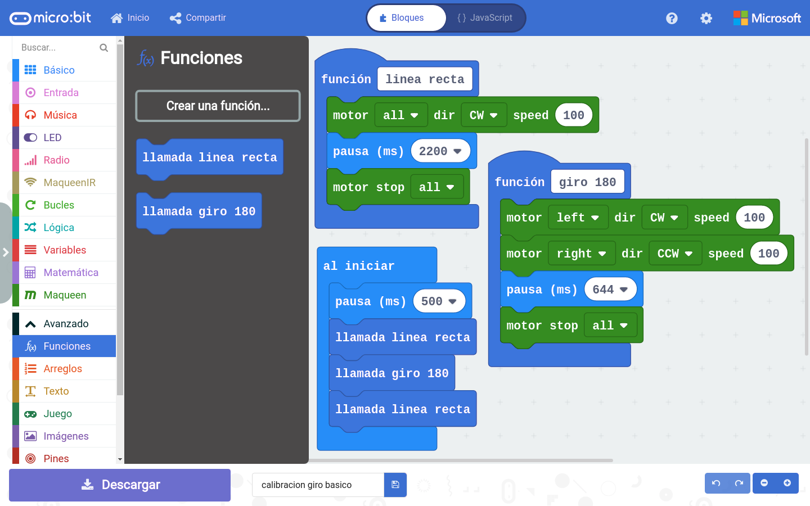
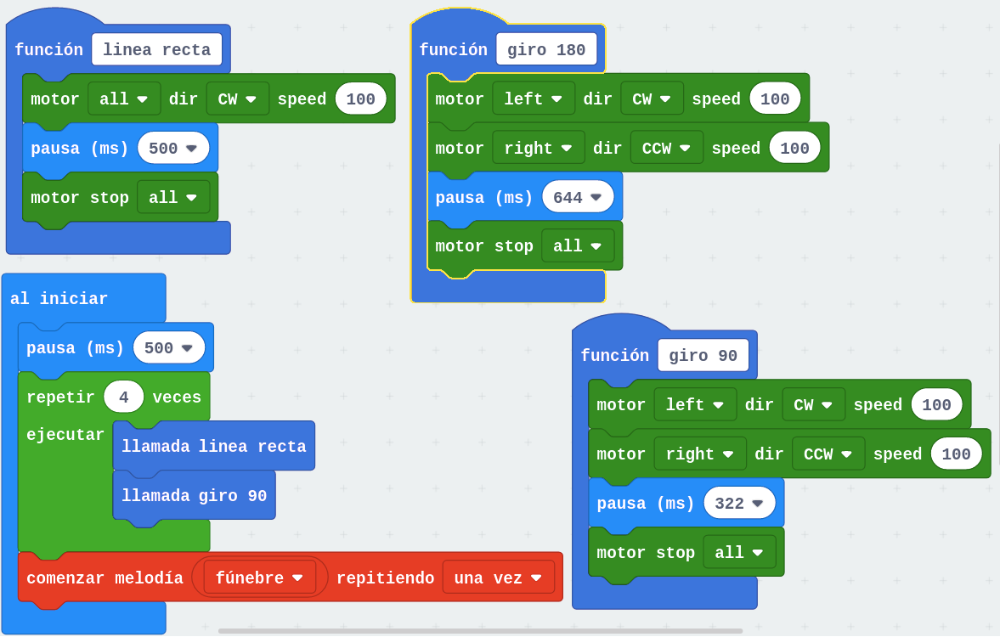
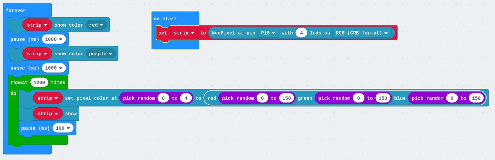
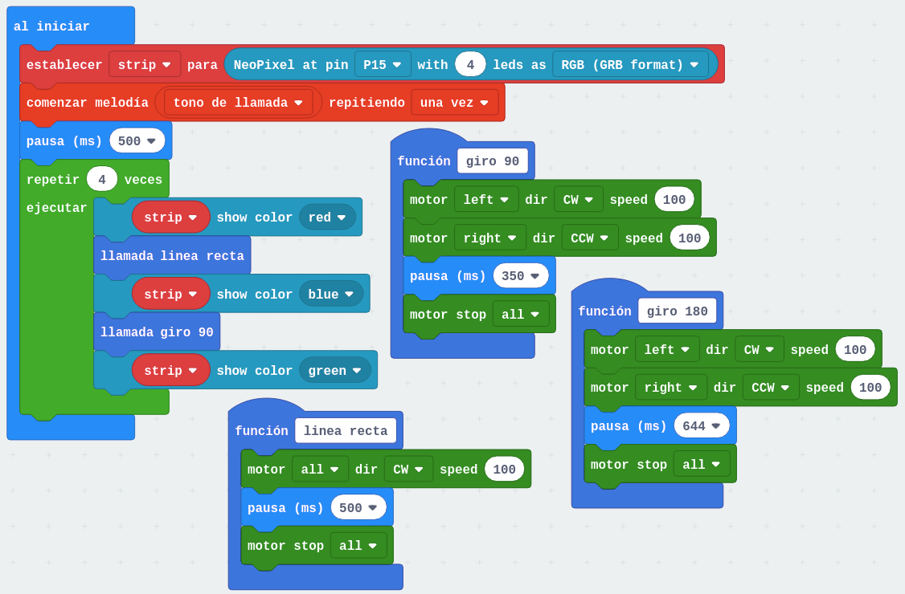
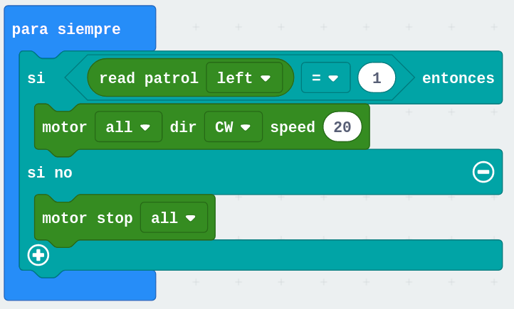
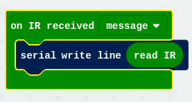
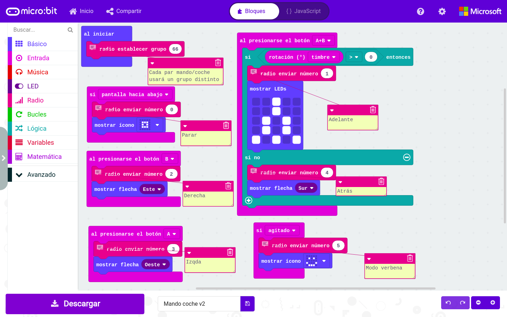
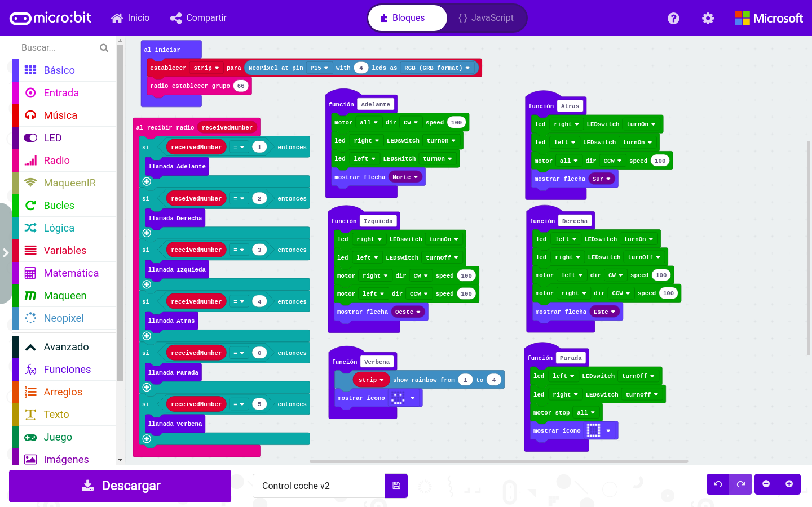

# Robot MaQueen

[Documentación dfrobot](https://wiki.dfrobot.com/micro:Maqueen_for_micro:bit_SKU:ROB0148-E(ROB0148))

### Programación con bloques

Para poder programarlo desde Makecode con bloque tenemos que añadir su extensión, para lo que pondremos en el buscador de extensiones la siguiente URL https://github.com/DFRobot/pxt-maqueen

### Ejemplos

#### Movimientos sencillos y led delanteros

Vamos hacer un ejemplo sencillo de movimiento a la vez que encedemos y apagamos los led rojos delanteros

[Proyecto](https://makecode.microbit.org/_ixqfbfA2HAxu)

#### Girando N grados o moviéndonos X cm

Para poder controlar con cierta precisión (hay que recordar que los motores del robot son motores DC y que no está pensado para hacer movimientos precisos) vamos a empezar midiendo el tiempo necesario para conseguir hacer esos movimientos. Esto es un proceso de calibración de los movimiento que podíamos hacer una forma más serie y científica midiendo distancias con la regla y ángulos

Empezaremos viendo el tiempo que necesitamos para hacer un giro de 180º.
Luego veremos el tiempo necesario para recorrer.

Para facilitar el proceso hemos creado dos funciones. Una función es una manera de crear nuestro propios bloques que funciona como un "atajo" para reutilizar varias veces un grupo de bloques datos. Para ello pulsamos en "Crear función" (en la paleta de funciones) y definimos los bloques que la compondrán. Cada vez que queramos utilizarla arrastraremos el bloque que hemos creado

Para hacer movimientos más complejos nos va a venir muy bien, puesto que podremos descomponerlos en movimientos más sencillos que se repetirán.

[Proyecto](https://makecode.microbit.org/_95LdTUac6UY5)

#### Recorriendo un cuadrado

Ya que le hemos pillado el truco a la calibración de distancias y giros vamos a hacer que maqueen recorra un cuadrado. Para ello crearemos una nueva función "Giro 90"

[Proyecto](https://makecode.microbit.org/_hCYV6Jga1gJE)

#### 4 x Leds RGB

Antes de programar las leds RGB añadimos la extensión de NeoPixels

[Ejemplo sencillo](https://makecode.microbit.org/_FXpHRk6m28pb)
Seleccionamos el P15 que es al que están conectados los 4 neopixels

#### Movimiento + leds colores + sonido = coche de policía

Vamos a combinarlo todo añadiendo algo de sonido

[Proyecto](https://makecode.microbit.org/_D66U4o6Mm83D)

#### No te caigas

Vamos a utilizar los sensores de infrarrojos que tiene maqueen en la parte de abajo para evitar que se caiga de la mesa. Desgraciadamente el diseñador los ha puesto detrás de la rueda loca con lo que salvo que nos movamos muy, muy despacio la rueda va a sobresalir de la mesa con el considerable peligro

[Proyecto](https://makecode.microbit.org/_iTR64w0P1Jtc)
 
#### Receptor de infrarrojos

Lee los datos y se quedan con los últimos dígitos

Con este sencillo programa podemos ver los códigos de las distintas teclas de los mandos

https://makecode.microbit.org/_Dm7961WkhHP6

        screen /dev/ttyACM0 115200

### Mando a distancia

Vamos a usar las comunicaciones por radio para comunicar 2 microbit: una que actuará como mando y la otra que controlará a maqueen

Estableceremos unos códigos numéricos para cada orden y la pulsación de los botones del mando y algunos gestos enviarán esos códigos

|Botón/Gesto| Acción|Código
| --- | --- | ---
|A+B inclinado hacia arriba|Adelante| 1
|A+B inclinado hacia abajo|Atrás|4
|A|giro a la izquierda|3
|B|Giro a la derecha|2    
|Pantalla cara al suelo|Parar|0
| Agitado | Luces On |5

Para hacer visible la orden que vamos a enviar se mostrarán unos iconos/flechas en la pantalla del mando

Usaremos un grupo de radio distinto para cada par mando/maqueen

En la micro:bit de maqueen establecemos el mismo grupo de radio y  en función del código recibido realizaremos las acciones correspondientes.

Para hacerlo más claro se han definido funciones, una para cada acción. En ellas se hacen los movimientos correspondientes, se encienden/apagan leds y se muestran los mismos iconos en la pantalla

Para probarlo programamos las 2 micro:bit cada una con su programa y vemos que efectivamente cuando se manda una orden la otra muestra el mismo icono.

Una vez verificado el funcionamiento montamos la micro:bit correspondiente en maqueen y a probar los movmientos

[Mando v2](https://makecode.microbit.org/_MsWR74gMag54)

[Control coche v2](https://makecode.microbit.org/_hrzTPR2TX380)

## Otros retos

### Sígueme

Medimos la distancia con el sensor de ultrasonidos y nos movemos en función de que la distancia se haga mayor o menor que una determinada.

### Siguelíneas

Usamos los sensores infrarrojos de maqueen seguimos una línea negra. Para ello cambiamos de dirección si uno de los sensores detecta blanco.

#### Motores
 
[Movimientos random](https://makecode.microbit.org/_EkmXK2DV3Edq)

 
[Movimientos básicos](https://makecode.microbit.org/_8mva3TEVH0rM)

[Sonidos y leds delanteros](https://makecode.microbit.org/_XrVhsU9tuH5x)

[Me muevo cuando hay luz](https://makecode.microbit.org/#editor)

[Ciclos de color RGB](https://makecode.microbit.org/_6hh2pqT959hh)

[Muestra la distancia](https://makecode.microbit.org/_AKAVHXVqkJM3)

[Huyo de los obstaculos](https://makecode.microbit.org/_C888wYRmrFAf)

[Siguelineas](https://makecode.microbit.org/_ApcYWLC3z7ok)

### Programando con Arduino

[Programación de Maqueen con Arduino](https://www.instructables.com/id/Using-the-DF-Robot-Micro-Maqueen-MicroBit-Robot-Pl/)

### Recursos 

[Wiki del producto](https://wiki.dfrobot.com/micro:Maqueen_for_micro:bit_SKU:ROB0148-E%28ROB0148%29)

[Página del producto](https://www.dfrobot.com/product-1783.html?search=maqueen)

[Ideas para retos](https://raw.githubusercontent.com/Frances9/ROB0148/master/Crazy%20Maqueen%20Tutorial-English.pdf)

[Otros ejemplos de movimiento](https://www.rapidonline.com/bitbot)

[PodCast de Juegos Robótica sobre maqueen](https://juegosrobotica.es/podcast-036/)