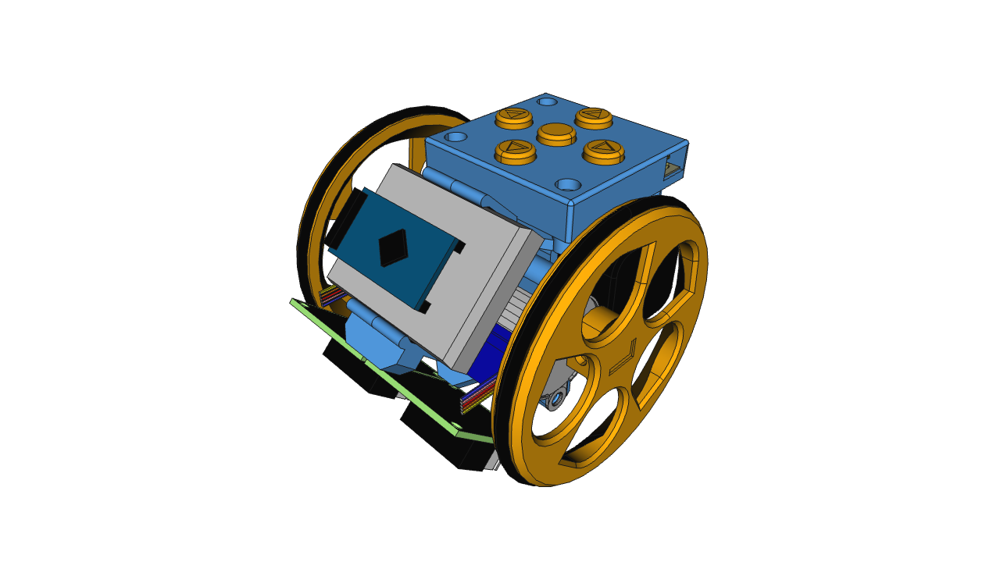

## Ejemplos de robótica en educación Infantil, Primaria y más allá

### ¿Por qué usar la robótica en primaria?

* Interacción. 
* Conexión con el mundo físico. 
* Introducción a la robótica.
* Introducción a la programación.
* Introducción a la electrónica.

Nosotros usaremos Makey-Makey.

Pero vamos a ver otras alternativas.

## Beebot

Robot sencillo de usar pensados para primaria.

El más utilizado es la famosa "Abejita" Beebot

Programamos una sucesión de movimiento pulsando los botones de las fechas.

La parte educativa está en los **tableros**/**tapetes**

En el de la imagen podemos hacer que el robot se mueva deletreando palabras, o vaya a los cuadros de un mismo color.

## Escornabot

[Escornabot](https://escornabot.com/web/es) es la versión OpenSource, además desarrollada por profes... de los robot de tipo "Abejita"

El objetivo es que los chavales lo usen y a la vez aprendan que pueden construirlo, los componentes de un robot y conozcan la filosofía de compartir conocimiento de forma libre (Open Source)

El alumnado de 5º-6º de primaria puede montarlo y programarlo, los de primaria lo usan.

## [Micro:bit](./8.1.1.Microbit.md)

Es una placa desarrollada por la Fundación BBC y pensada para que todos los escolares británicos aprendan programación, electrónica y robótica.

* Incluye:
    * Muchos sensores
    * Bluetooth/Radio
* Programable con:
    * Scratch lo que permite integrarlo en nuestros programas

    * Bloques/Javascript
    
    * Python
* No necesita drivers
* 18€
* Incluye simulador
* Se puede usar como MakeyMakey
* Podemos usarlo en diferentes etapas con diferentes niveles de complejidad.

## [MakeBlock](./8.1.2.mBlock.md)

* Programable con:
    * Scratch 3.0, lo que permite integrarlo en nuestros programas
    * mBlock
    * Arduino
* Robusto
* Trabajamos la mecánica
* Iniciación a la electrónica y Arduino

## [Echidna](./8.1.3.echidna.md)

* Incluye muchos sensores
* Desarrollado por profes
* Programable con:
    * Scratch 3.0, lo que permite integrarlo en nuestros programas
    * mBlock
    * Arduino
* Iniciación a la electrónica y Arduino

## Arduino

## Lego WeDo

## Lego Ev3

[Presentación: Robótica en Primaria](https://docs.google.com/presentation/d/1o0JGiDu6wkU9-KzoVodnO4xihsjJHjj88dO6EMfBfF4/edit?usp=sharing)

[Vídeo: Ejemplos de robótica en  educación Infantil y Primaria](https://youtu.be/CH79S9pZKxo)
