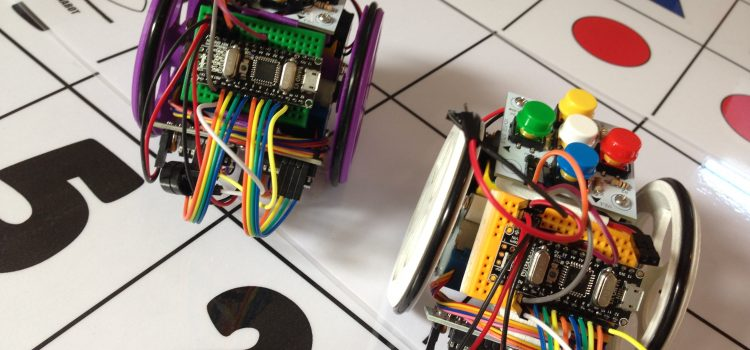
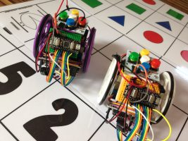
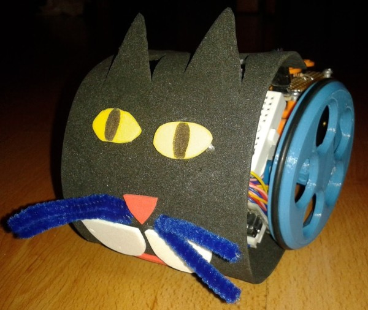
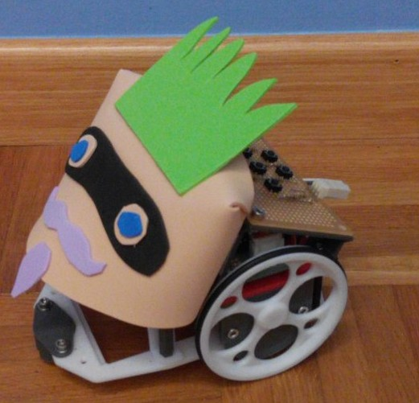

# [Escornabot](https://escornabot.com/web/es)

Escornabot es un robot de suelo pensado para trabajar con los más chiquitines utilizando tablero para fomentar le por un lado el aprendizaje de los temas relacionados con la programación y la robótica y por otro lado para mediante el juego y trabajando los contenidos que los profes les ponemos en los tableros por los que se mueve el robot.

Es una versión Open source de robots comerciales como pueden ser BeeBot o el ratoncito.

[Comparativa: Escornabot vs BeeBot](https://www.youtube.com/watch?v=fuE7P22zBrQ)

Es un robot más que opensource, es un robot con vocación Do It Yourself, pensado para que los niños lo monten o al menos vean cómo se monta.

Desde [esta página](https://pablorubma.cc/escornabot/) (¡¡Gracias Pablo!!) tenéis acceso a las diferentes versiones donde nos explican como programarlo pues decidir entre versiones:

* Más complejas de montar,la **[DIY](https://pablorubma.cc/escornabot/version-diy/)**, en la que los chavales tienen que aprender a hacer el cableado, y todo el montaje. Nos lleva perfectRecomendamos esta versión para el alumnado por encima de los siete ocho años depende más de la madura y de la capacidad que tenga y lo acostumbrado que esté a estos temas que el curso o los añosamente 2-3 horas para montarlo completo, pero por el camino se aprende en un montón de cosas de electrónica y de montaje. 

* También existe otras versiones más sencillas como el [Singularis](https://pablorubma.cc/escornabot/version-2-12-xdesig/) y  la [Brivoi](https://pablorubma.cc/escornabot/version-compactus/) en  las que toda la electrónica ya está soldada en una placa y el cableado en mínimo, lo que nos permite montar sin ningún problema en menos de una hora explicando los componentes y trabajandolo todo.

Dependiendo del enfoque que queramos darle usaremos unas u otra: si lo que queremos es trabajar más en la parte de aprendizaje de electrónica de robótica y ellos están capacitados, empezaremos con la versión Do It Yourself y si están empezando con el tema mucho mejor cualquiera de las otras versiones

En cualquier caso también podemos ir avanzando empezando por una versión más sencilla y a medida que yo van aprendiendo y le van cogiendo el truquillo pues vamos pasando a otras versiones un poco más complicada de montarle

[Documentacion](https://bricolabs.cc/wiki/proyectos/escornabot)

Se puede disfrazar

Está pensado para que lo puedan manejar niños muy pequeños

[ejemplo](https://twitter.com/beatriz_cia/status/610775534503624704)

Con un poco de imaginación....

[Video del reto de la ciudad](https://www.youtube.com/watch?v=v5R_0wfpw7g)

[Video de la programación del reto del laberinto](https://www.youtube.com/watch?v=qWTPiRxQH44)

Para montar un  laberinto

# Venga, va, me lo construyo

[Instrucciones versión 1](https://docs.google.com/presentation/d/1turjK-9XJMr4ZNjo0-ty71CvBSDX8ekR_q3EhAwWK2w/edit#slide=id.g44a5bbf06_122)

[Instrucciones versión 2](https://docs.google.com/presentation/d/1wiLGgJkgVf4k_q3OCkZja2lMNZ-3-n-bs_xkO_ioCBY/edit#slide=id.ge69b0fc81_0_413)
[Tutorial de montaje de la v2](http://escornabot.org/wiki/index.php/Gu%C3%ADa_de_montaje_(Brivoi))

# Recursos sobre Escornabot

[Documentación curso Catedu sobre escornabot](https://catedu.gitbooks.io/escornabots/content/)

[Documentación Pablo Rubma](https://pablorubma.cc/escornabot/)

[Programación de escornabot con bloques](http://www.mecatronicalab.es/programando-escornabot-con-mblock/)

# Tableros o tapetes

¿Tableros de 10x10 o de 15x15?

[Colección de tableros](https://docs.google.com/spreadsheets/d/e/2PACX-1vT2UIHUY5yT-1Nx49usL2jkSh80sVlJf4mEJuLSGS1DpGWDXXeIRRlq4jXfyY2lRx0c9nIlLeEx4npQ/pubhtml)

[Ejemplo de actividades](https://olmedarein7.wixsite.com/roboticainfantil/actividades)

[Jugar a las parejas](http://apprendiendoconrobotica.blogspot.com/2015/04/parejas-con-bee-bot.html?m=1)

[Vocales](http://rincondeunamaestra.blogspot.com/2017/11/robotica-y-vocales_21.html)

[Actividades](https://olmedarein7.wixsite.com/roboticainfantil/actividades)

## Colecciones

[Colección de Pablo Rubma](https://pablorubma.cc/escornabot/tableros-y-recursos/)

[Catedu](https://catedu.gitbooks.io/escornabots/content/material-para-trabajar-en-clase/tableros-y-fichas.html)

[Colección para beebot](https://www.pinterest.es/mertxejbadiola/tapetes-bee-bot/)

[Documentación Pablo Rubma](https://pablorubma.cc/escornabot/tableros-y-recursos/)

[Coleccion de tableros en la web de escornabot](https://github.com/escornabot/docs/tree/master/Escornabot_Mats)

[Colección de más tableros](https://docs.google.com/spreadsheets/d/e/2PACX-1vT2UIHUY5yT-1Nx49usL2jkSh80sVlJf4mEJuLSGS1DpGWDXXeIRRlq4jXfyY2lRx0c9nIlLeEx4npQ/pubhtml )

[Tapete transparente para usar con tarjetas](https://infanity.es/producto/tapiz-recuadros-transparentes-para-beebot/)

# Dados

Angel LoBarri de [La Escuela Maker ha creado y compartido estos dados](https://laescuelamaker.com/2018/08/09/codices-los-dados-para-iniciarte-en-la-programacion/)

### Dado de movimiento

[STL](https://www.thingiverse.com/download:5272428)

### Dado de control

[STL](https://www.thingiverse.com/download:5077307)

### Dado de lógica

[STL](https://www.thingiverse.com/download:5077304)

### Dado de matemáticas

[STL](https://www.thingiverse.com/download:5077305)

### Dado de 10 números

[STL](https://www.thingiverse.com/download:8603)