# Una propuesta buena, bonita, barata y ampliable, divertida … : micro:bit

## Necesitamos:

* Que sea **sencilla de usar** para empezar
* **Simulador incluído** en el entorno de trabajo (ideal para trabajar desde casa)
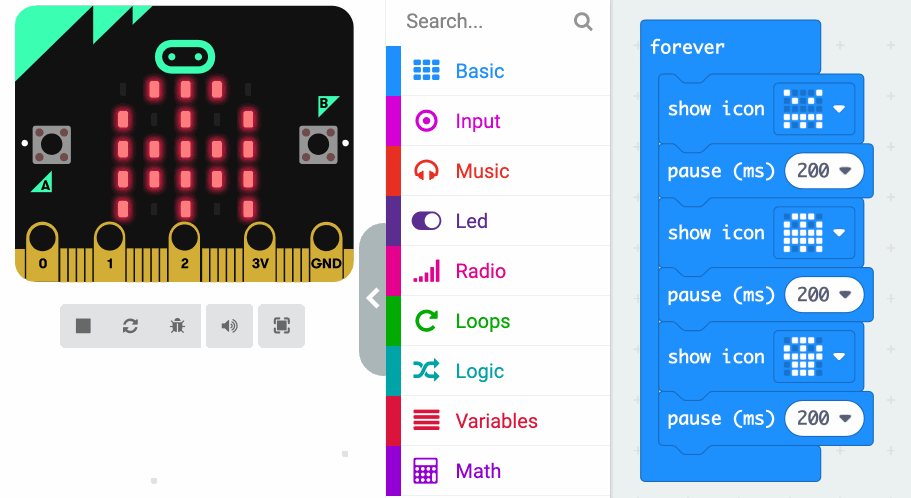
* **Compatible** con otros entornos como **Scratch**
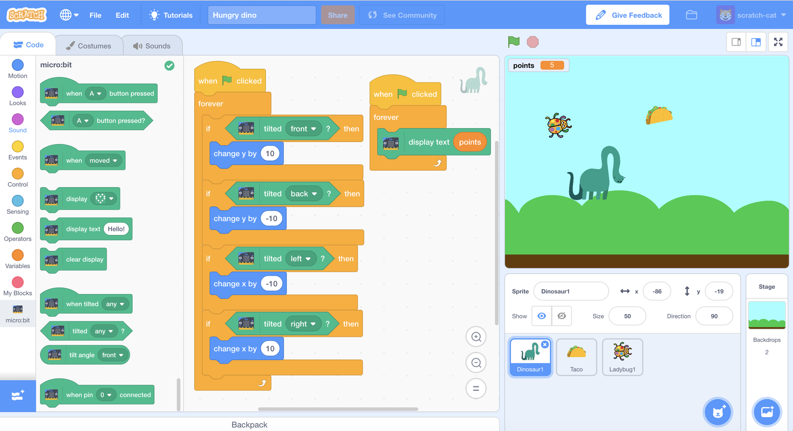
* **Divertida**
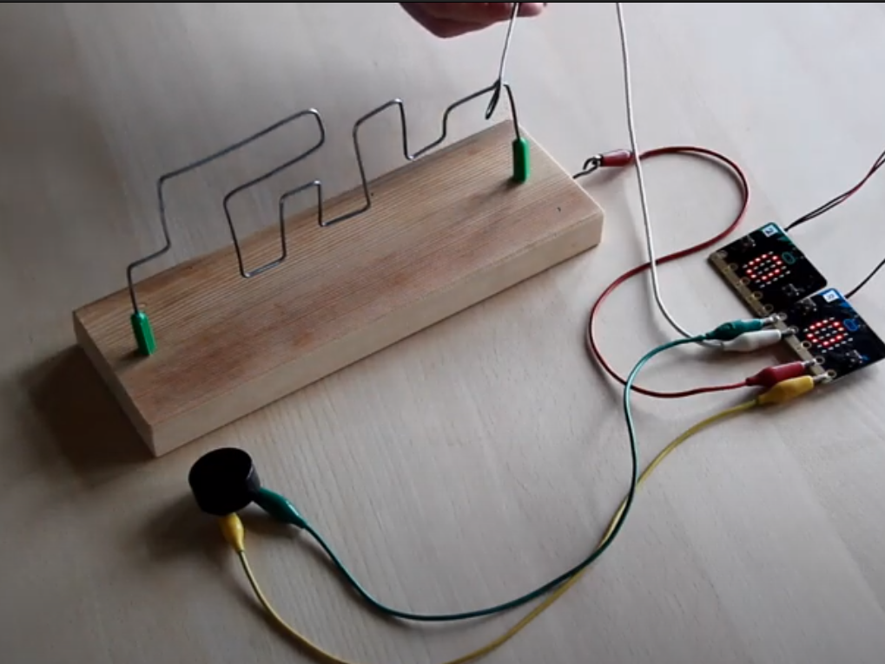
* Con **documentación** clara y multitud de ideas 
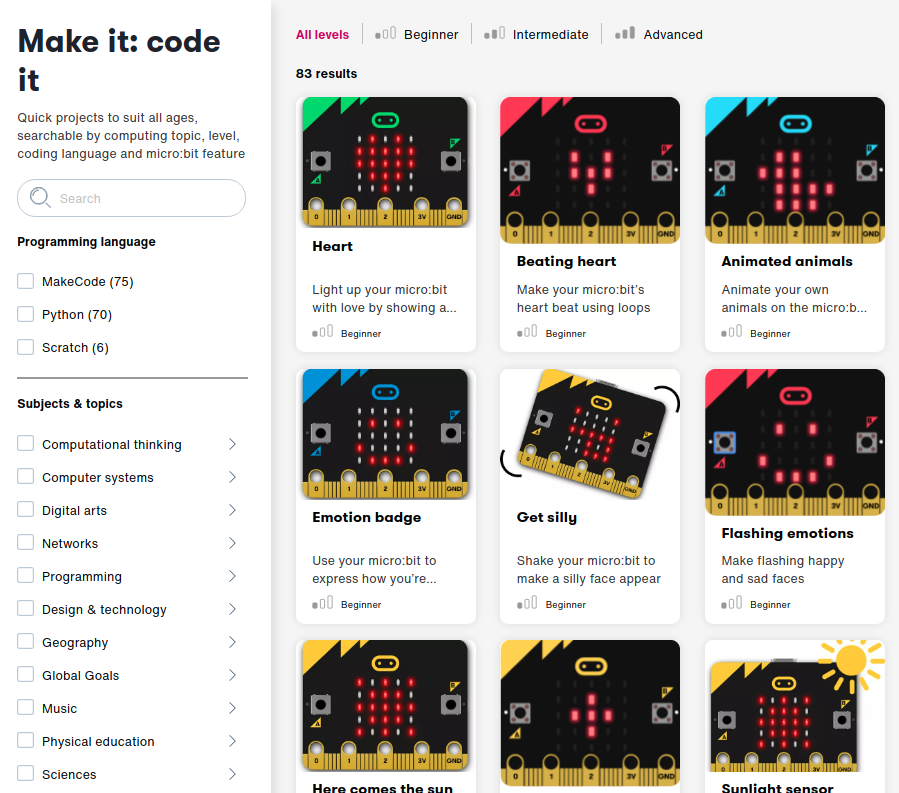
* **Barata**: desde **18-20€**

# micro:bit

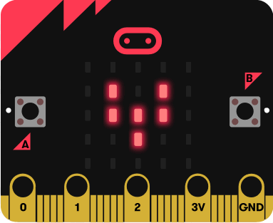

## Adaptable a varios niveles: 
* **Programación con bloques**

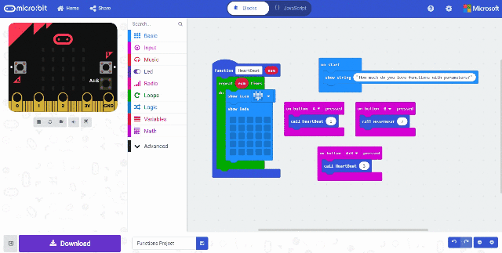

* Uso en **primaria**

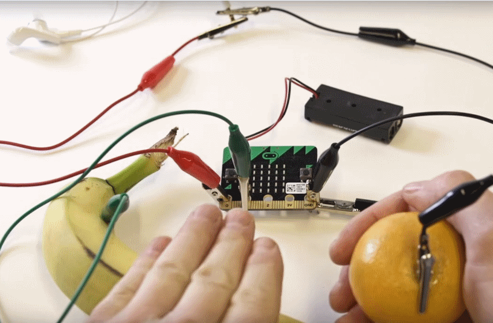

* Como **iniciación a la electrónica/robótica**

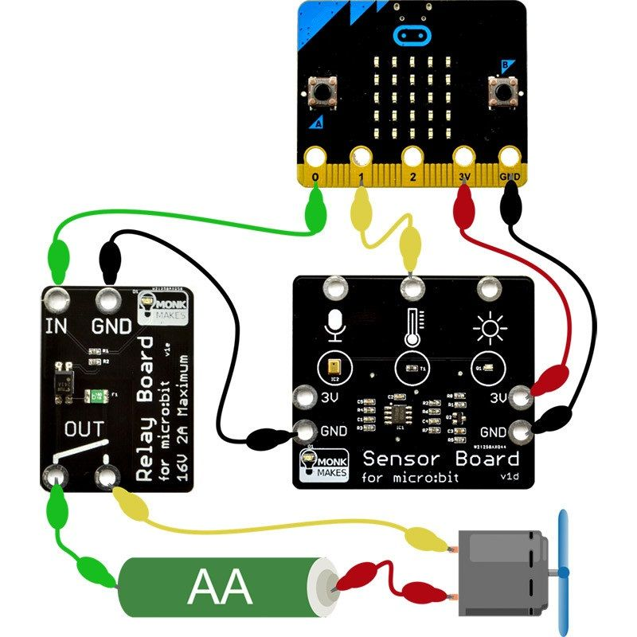

* **ESO** - **Tecnología** y robótica

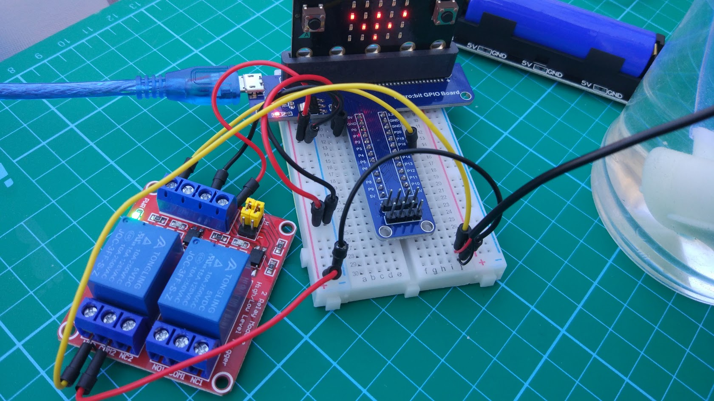

* Programación con otros lenguajes: **Python**, C++

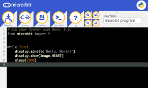

## STEAM

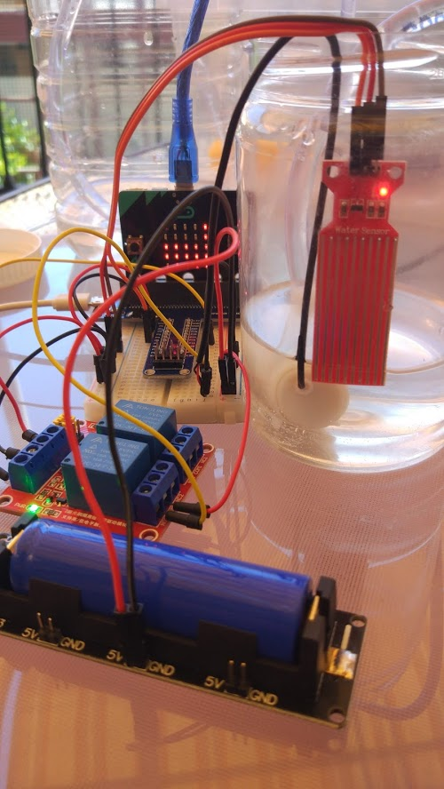

**Proyectos**: Sistema de riego de minihuerto

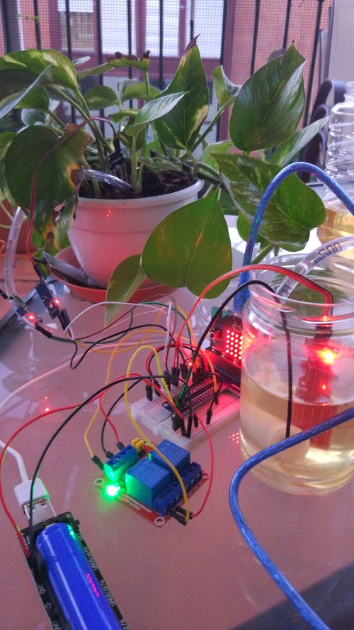

* Ampliable: multitud de **kits de ampliación**

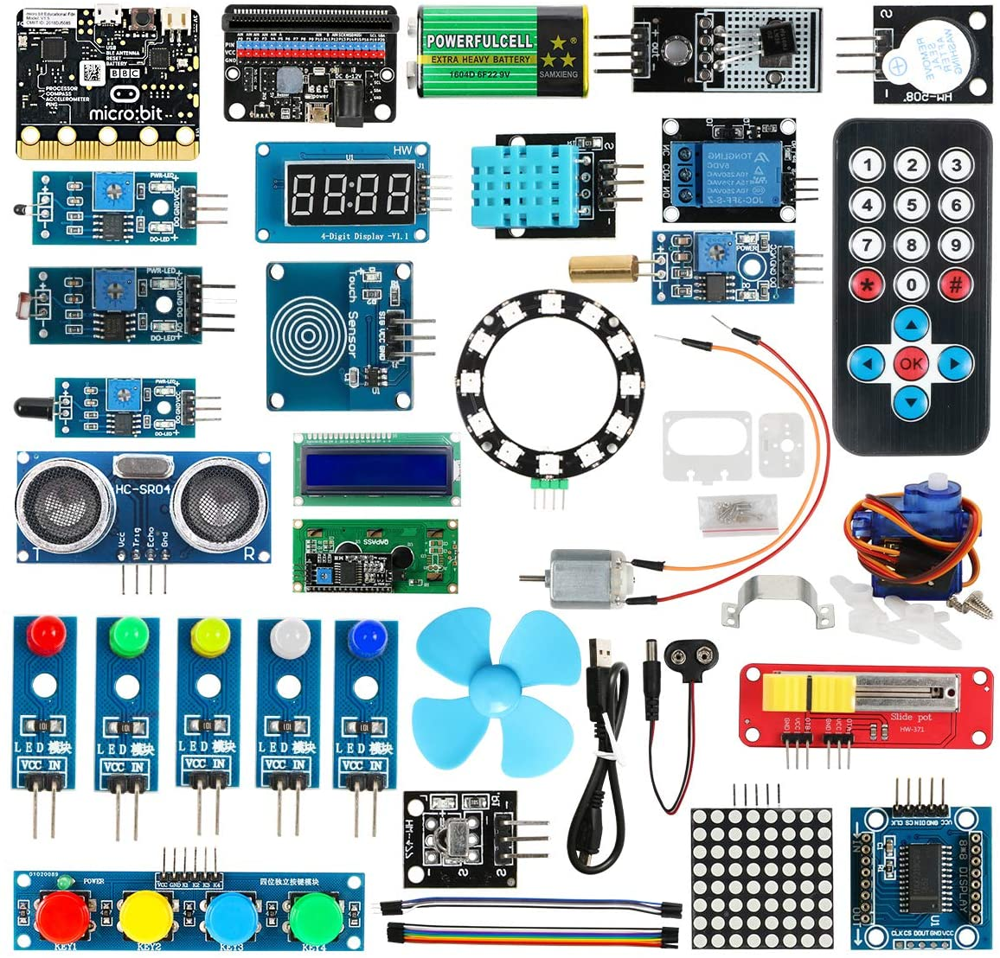

* Es totalmente de código abierto (100% Open Source) **compatible** con todos los SO y usable desde el navegador, **sin instalar nada**
