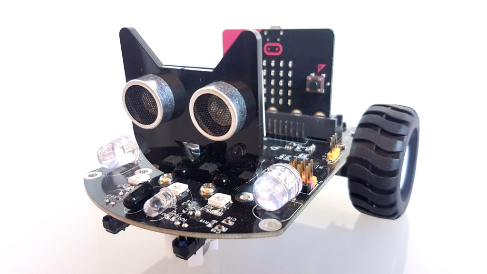
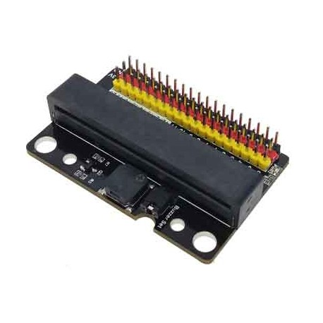
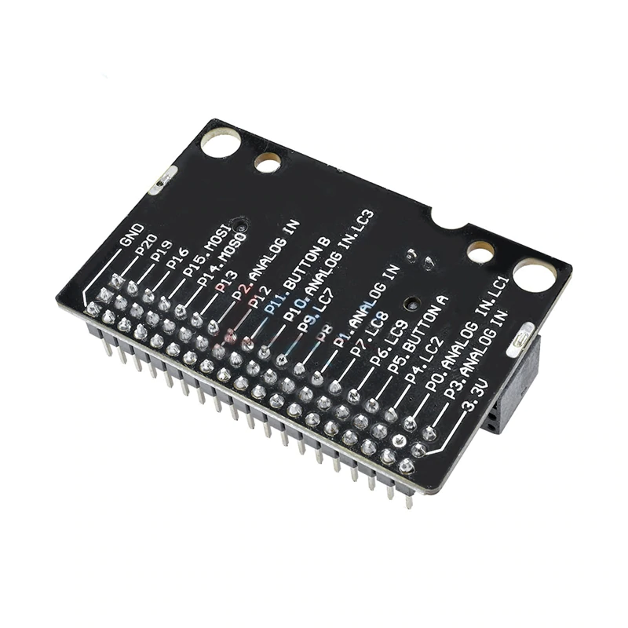
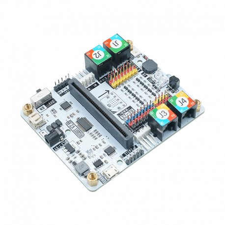
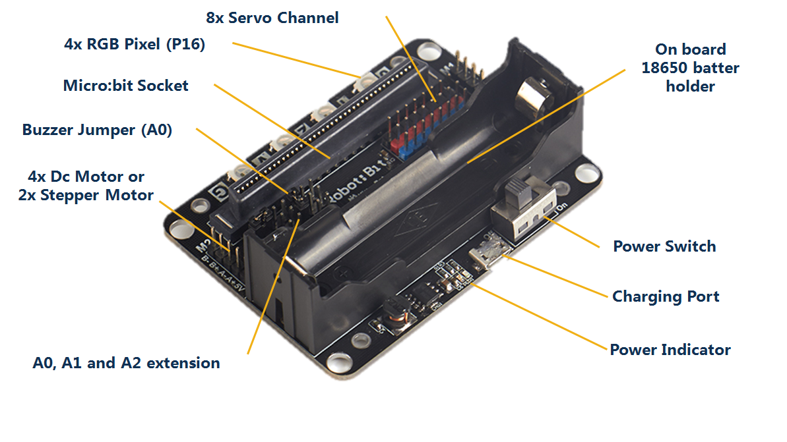
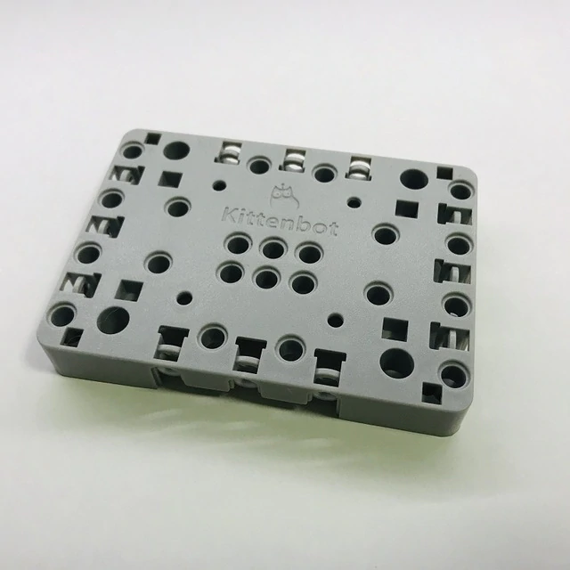
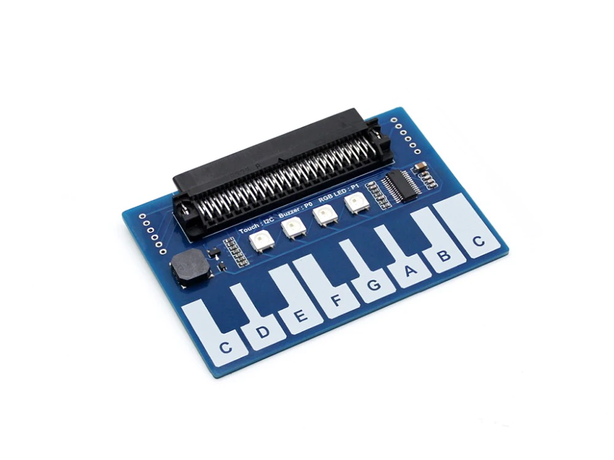

# Complementos

## [Coche - micro:bit](https://www.micro-log.com/microbit/3283-coche-microbit.html)

Similar a maqueen, y precio muy parecido, pero con mejores características. Incluye batería, los sensores de línea están donde tienen que estar, 2 tipos de leds RGB, emisor y detector de infrarrojos, mando a distancia de infrarrojos, ...

Se programa con la siguiente extensión [https://github.com/lzty634158/yahboom_mbit_en](https://github.com/lzty634158/yahboom_mbit_en)

[Documentación](https://microbit.micro-log.com/coche-microbit/)

## [Conector micro:bit](https://www.micro-log.com/microbit/3324-conector-microbit.html) ó [éste]()

Adaptador para conectar sensores, actuadores y servos compatibles con Arduino y similares

## [Adaptador micro:bit-mblock](https://www.micro-log.com/microbit/3371-shield-robit-v20.html)

La placa incluye:

* Tamaño para montar sobre chasis de mBlock.
* Emisor y receptor de infrarrojos.
* Conexiones para 2 motor paso a paso.
* Conexiones para 4 motor de C.C.
* Conexiones para 8 servomotores.
* 1 Zumbador.
* 2 Leds RGB programables.
* Pines de conexión
* Conectores RJ para motores y sensores de MakeBlock

Para utilizarlo usaremos la extensión **Robit**

[Documentación](https://microbit.micro-log.com/robit-v2-0/)

## [Robotbit](https://es.aliexpress.com/item/32863886903.html)

* Pensada para controlar robots
* Incluye zócalo para batería recargable 18650 que se puede recargar
* Maneja 8x servos y 4x DC motores o 2x steppers. Permite la conexión directa de los motores baratos 28-DIJ-48
* Zumbador 
** 4x RGB Neo Pixels

Para usarla trabajamos con la extensión [https://github.com/KittenBot/pxt-robotbit](https://github.com/KittenBot/pxt-robotbit) 

Para utilizarlo usaremos la extensión **Robotbit**

## Módulo piano

