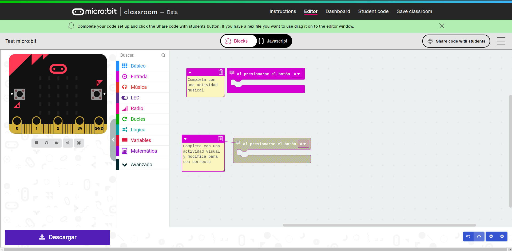
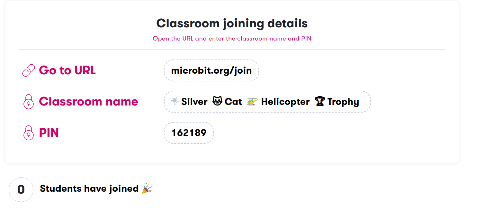
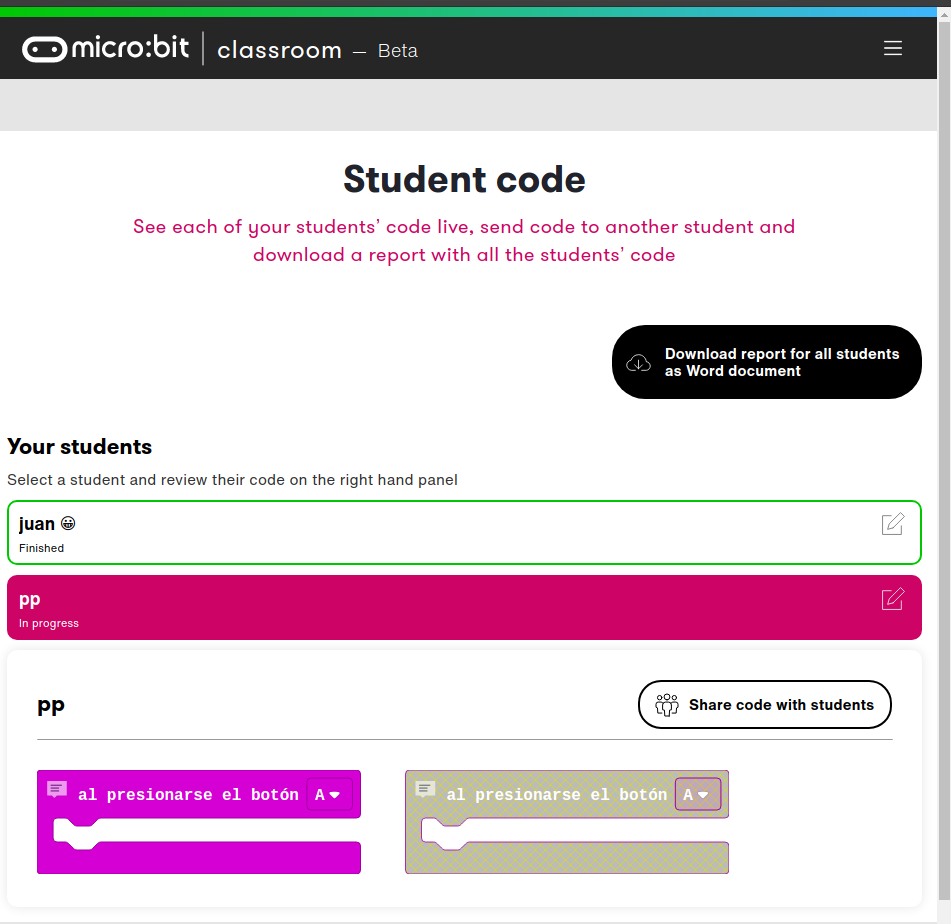

## Trabaja de micro:bit en clase

Es un sistema sencillo parecido a google classroom, pero muy simplificado. 

Podremos enviar la tarea a los alumnos y ver cómo ellos lo resuelven

Tenemos la web del profesor, donde se crea la actividad

https://classroom.microbit.org/

1. Creamos una proyecto plantilla con la actividad, que le enunciamos a los alumnos. Debe ser autocontenida, pues en este momento no se puede completar con un texto o documento adjunto

Cuando terminamos pulsamos en "Share code with students"

1. Iniciamos la actividad dándole los detalles de conexión pulsando en la opción "Dashboard"

Donde veremos cómo se van conectado los estudiantes

1. Los estudiantes se conectan a [microbit.org/join](microbit.org/join) e introducen los datos de conexion (4 símbolos y el pin)

1. En la página del profesor iremos viendo el estado de las entregas y si pulsamos sobre uno de los estudiantes lo que va haciendo, así coma la valoración que ellos han hecho del ejercicio.

Desde esta página podemos descargar un listado con los ejercicios que han enviado los alumnos