# Ejemplos

## Dibujos en los leds

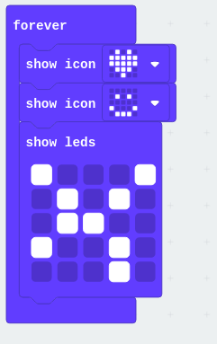

[Ejemplo](https://makecode.microbit.org/_2umDKgXr687x)

## Cálculos sencillos

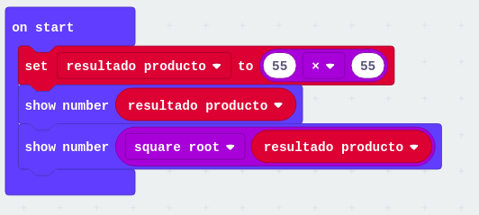

[Ejemplo](https://makecode.microbit.org/_L9iibr2646bF)

## Contando de 0 a 12

[Ejemplo](https://makecode.microbit.org/_avMERWV6DW3i)

## Contador de 12 a 0

[Ejemplo](https://makecode.microbit.org/_VaPMFeUmph3e)

## Interacción con botones: eventos

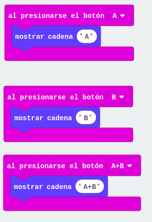

[Ejemplo](https://makecode.microbit.org/_HiMTd56HvbXF)

## Quiz: preguntas y respuestas

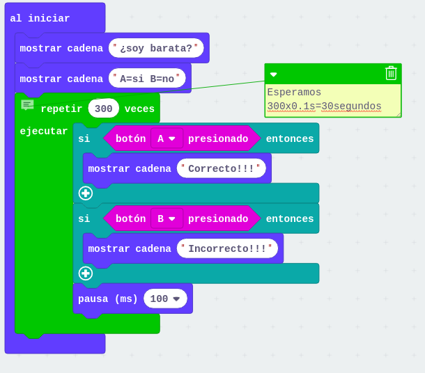

[Ejemplo](https://makecode.microbit.org/_5rFevrfKAVwJ)

## Cuenta personas

### Comprobando los pulsadores

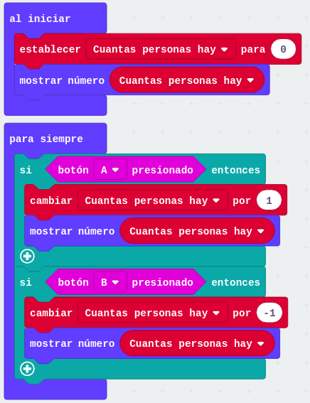

[Proyecto](https://makecode.microbit.org/_2tM31LEe6f93)

### Usando eventos

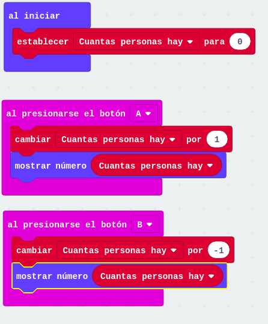

[Proyecto](https://makecode.microbit.org/_aRMTbjKDb5AD)

## Dado 0-9 o letra aleatoria

Vamos a convertir nuestra micro:bit en un dado aleatorio
* Si la agitamos nos dará un número aleatorio entre 0 y 9
* Si pulsamos el botón A nos mostrará una letra (de entre unas determinadas) para cualquier juego de palabras. 

Para ello usamos el bloque de elegir un número aleatorio (que está en Matemáticas) y las herramientas de Texto (en avanzado) para seleccionar la letra escogida

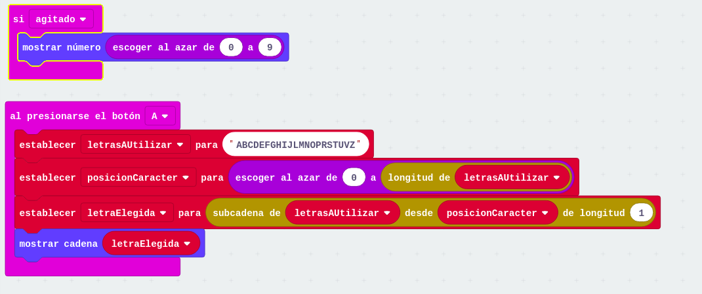

[Ejemplo](https://makecode.microbit.org/_1VsbxM97Cbi9)

## Dando color a la vida

Un led RGB (o neopixel si usamos la marca de @adafruit) está formado por 3 leds Rojo, verde y azul en el mismo encapsulado. 

Encendiendo o apagando unos y otros podemos producir el efecto de generar luces de distinto color

A cada uno de ellos le podemos dar una intensidad entre 0 y 255. Si usamos un [selector de color](https://htmlcolorcodes.com/es/) podemos encontrar los valores adecuados para producir un color concreto.

Para utilizarla con micro:bit necesitamos incluir la extensión neopixel des la paleta **Extensiones** desplegando **Avanzado**.

os leds la forman. En nuestro caso la hemos conectado a P0 y son 4

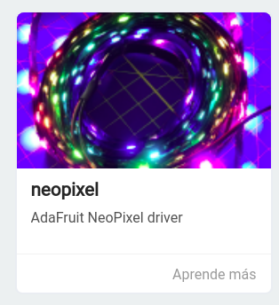

Vamos a hacer un programa que muestre distintos colores al pulsar los botones.

Antes de empezar a manejar los neopixeles debemos inicializar, en el contenedor **Al inciar**, la tira de leds indicando a qué pin está conectada y cuántos leds tenemos.

* Al pulsar el botón A ponemos color púrpura
* Al pulsar el botón B ponemos color naranja
* Al pulsar los dos a la vez un color formado por los valores RGB 123, 200 y 50

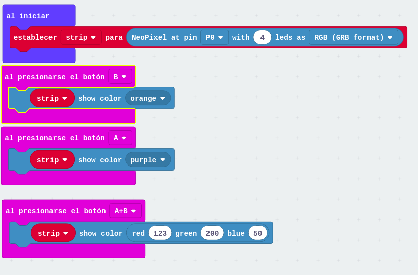

### Ejercicio

Mostrar distintos colores al agitar de diferentes formas la micro:bit

## Termómetro con color

Incluímos la extensión **Neopixel**

Vemos cómo podemos "controlar" la temperatura desde el simulador

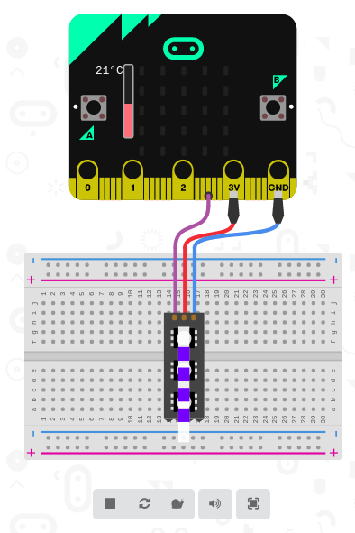

Medimos la temperatura. Si es mayor que 25 ponemos los led en rojo, si es menor en azul

En caso de que se pulse el botón A mostramos la temperatura  actual

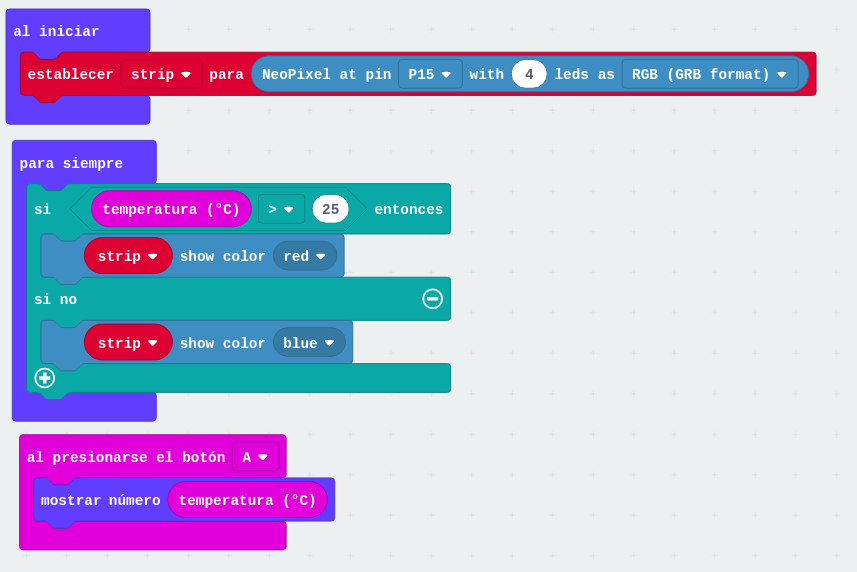

[Ejemplo](https://makecode.microbit.org/_XcPcJEfhvd3v)

## Radio

### Dado numérico remoto

Al agitarlo se elige un número aleatorio entre 0 y 9 y se envía a todas las placas del mismo grupo

Establecemos el número de grupo para que todas las micro:bit se escuchen

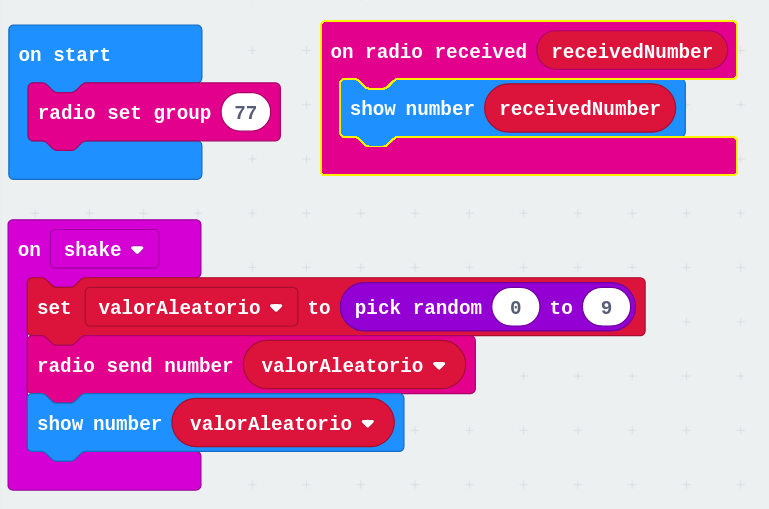

[Proyecto](https://makecode.microbit.org/_ft6bim3q7ayP)

### Dado alfabético remoto

Cambiamos los bloques referidos a números por los correspondientes a letras

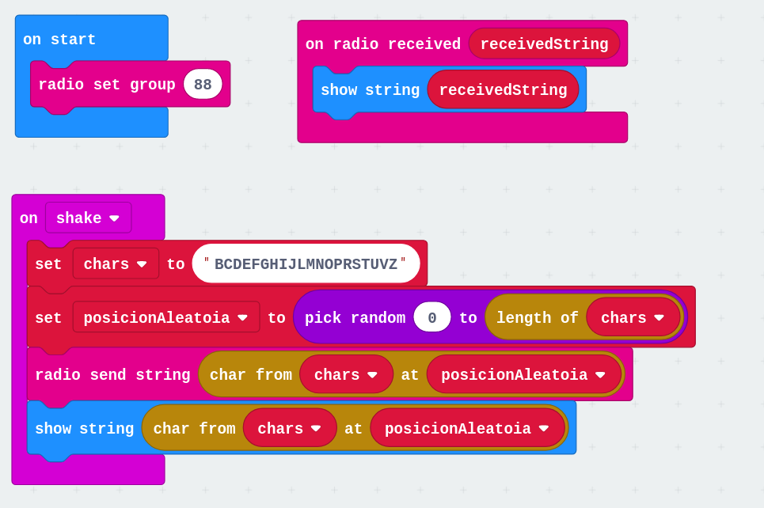
[Proyecto](https://makecode.microbit.org/_dC1hzRVkzELx)

### Ejercicio

Comparte tus emociones: selecciona con los botones A y B tu estado de ánimo y compártelo al pulsar A+B. Si lo agitas tendrás un estado aleatorio...

### Compartiendo variables y valores

Para ello usaremos los bloques de envía etiqueta/valor

### Giróscopo

Un giróscopo es un sensor que nos permite medir el sentido de giro. Comparamos la micro:bit con un avión para entender el ejemplo. 

En esta imagen de @tigerjython4kids se ve claramente 

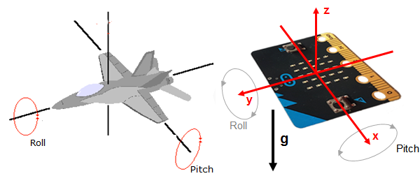

Dos ángulos definen la posición:

* Pitch o inclinación (traducido en makecode por timbre)
* Roll o giro

Podemos ver el grado de giro de cada uno usando sus valores correspondientes. Si tenemos plana nuestra micro:bit como en la imagen, ambos ángulos son 0. Si la inclinamos hacia adelante Pitch sería negativo y si la inclinamos hacia la izquierda lo sería Roll

Usando estos ángulos podemos hacer muchos proyectos:

* Un nivel que ilumina distintos leds, según la inclinación, mostrando el led central si estamos en Pitch = 0 y Roll = 0
* Un Teremin-inclinómetro que varía la frecuencia del sonido en función de la posición

### Brújula

https://catedu.gitbooks.io/micro-bit/content/la_brujula_detecta_el_campo_magnetico_terrestre_po.html

### Piedra papel o tijera multiuser

[Ejemplo](https://makecode.microbit.org/projects/rps-teams)

Usamos radio para comunicar placas

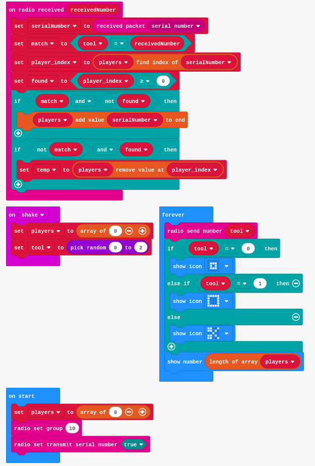